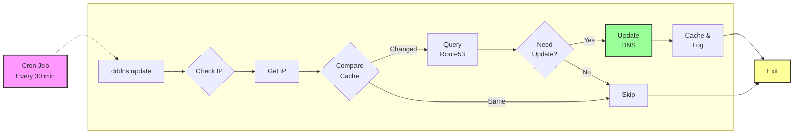

# Descoped Dynamic DNS - dddns

[](https://github.com/descoped/dddns/actions/workflows/ci.yml)
[](https://codecov.io/gh/descoped/dddns)
[](https://goreportcard.com/report/github.com/descoped/dddns)
[](https://github.com/descoped/dddns/releases)
[](https://github.com/descoped/dddns/blob/main/LICENSE)
[](https://go.dev/)
[](https://github.com/descoped/dddns/releases)

Most home networks receive dynamic public IP addresses via DHCP lease from ISPs, which can change on lease renewal or connection reset.
Dynamic DNS (DDNS) solves this by automatically updating DNS records when your IP changes, keeping your domain (like `home.example.com`) always pointing to your current IP.

**dddns** is a lightweight, secure DDNS client specifically for AWS Route53, designed to run on resource-constrained devices like Ubiquiti Dream Machines.
Perfect for VPN access, home servers, remote management, or any service that needs consistent access to your home network.

## Features

### 🚀 Core Functionality
- **AWS Route53 Integration** - Updates DNS A records automatically (Route53 only)
- **Smart IP Detection** - Reliable public IP detection via checkip.amazonaws.com
- **Change Detection** - Only updates when IP actually changes
- **Persistent Caching** - Remembers last IP to minimize API calls
- **Proxy/VPN Protection** - Detects and prevents updates when behind proxy
- **Dry Run Mode** - Test changes without modifying DNS records
- **Force Updates** - Override cache when needed

### 🔒 Security
- **Device-Specific Encryption** - AES-256-GCM with hardware-derived keys
- **Secure Credential Storage** - Encrypted configs locked to specific hardware
- **No Environment Variables** - Credentials stored securely in config files
- **File Permission Enforcement** - Automatic 600/400 permissions
- **Memory Wiping** - Sensitive data cleared after use
- **AWS Profile Support** - Integrates with AWS CLI credentials

### 🖥️ Platform Support
- **Ubiquiti Dream Machine** - UDM/UDR with UniFi OS v3/v4
- **Linux** - AMD64, ARM64, ARM architectures
- **macOS** - Intel and Apple Silicon
- **Windows** - AMD64 and ARM64
- **Docker** - Container deployment ready
- **Automatic Platform Detection** - Adjusts paths and behavior per platform

### 📦 Deployment
- **Single Binary** - No dependencies, <10MB size
- **Low Memory** - <20MB runtime usage
- **Boot Persistence** - Survives firmware updates on UDM
- **Cron Integration** - Automated scheduling built-in
- **One-Line Installation** - Simple curl install for UDM
- **Logging** - Comprehensive logs with rotation


## Quick Start

### Ubiquiti Dream Machine (UDM/UDR)

```bash
# One-line installation
curl -fsL https://raw.githubusercontent.com/descoped/dddns/main/scripts/install-on-unifi-os.sh | bash

# Configure
dddns config init

# Test
dddns update --dry-run
```

> **⚠️ Compatibility Note**: Check [supported models and requirements](docs/INSTALLATION.md#supported-models) before installation.

### macOS

```bash
# Install via Homebrew
brew tap descoped/dddns
brew install dddns

# Configure and run
dddns config init
dddns update
```

### Linux

#### Debian/Ubuntu
```bash
# Download and install the .deb package
curl -LO https://github.com/descoped/dddns/releases/latest/download/dddns_Linux_x86_64.deb
sudo dpkg -i dddns_Linux_x86_64.deb

# For ARM64 systems:
curl -LO https://github.com/descoped/dddns/releases/latest/download/dddns_Linux_arm64.deb
sudo dpkg -i dddns_Linux_arm64.deb
```

#### Red Hat/CentOS/Fedora
```bash
# Install the .rpm package
sudo rpm -ivh https://github.com/descoped/dddns/releases/latest/download/dddns_Linux_x86_64.rpm

# For ARM64 systems:
sudo rpm -ivh https://github.com/descoped/dddns/releases/latest/download/dddns_Linux_arm64.rpm
```

#### Configure and run
```bash
dddns config init
dddns update
```

## Commands

```bash
dddns update [--dry-run] [--force] [--quiet]  # Update DNS record
dddns config init                              # Interactive configuration
dddns config check                             # Validate configuration
dddns ip                                       # Show current public IP
dddns verify                                   # Check DNS vs current IP
dddns secure enable                            # Enable encrypted config
dddns --version                                # Show version
```

## Documentation

- [Installation Guide](docs/INSTALLATION.md) - Detailed installation instructions
- [Quick Start](docs/QUICK_START.md) - Get running in 5 minutes
- [Configuration](docs/CONFIGURATION.md) - Configuration options
- [Commands](docs/COMMANDS.md) - Full command reference
- [UDM Guide](docs/UDM_GUIDE.md) - Ubiquiti-specific setup
- [Troubleshooting](docs/TROUBLESHOOTING.md) - Common issues and solutions

## How It Works



The flow ensures minimal API calls and only updates DNS when necessary, making it efficient and ISP-friendly.

> **💡 Cost Tip**: Running your own dynamic DNS with AWS Route53 costs approximately USD 0.50 per month for a hosted zone. This makes dddns a very affordable solution for reliable home network access.

## Development

### Prerequisites

- Go 1.22+
- Make

### Building

```bash
# Clone repository
git clone https://github.com/descoped/dddns.git
cd dddns

# Build for current platform
make build

# Build for UDM/UDR
make build-udm

# Run tests
make test

# Build all platforms
make build-all
```

### Project Structure

```
cmd/                  # CLI commands
internal/
├── config/          # Configuration management
├── crypto/          # Device-specific encryption
├── dns/             # Route53 client
├── profile/         # Platform detection
└── version/         # Version information
```

### Release Process

Releases use [GoReleaser](https://goreleaser.com/) with git tags:

```bash
git tag v1.0.0
git push origin v1.0.0
```

GitHub Actions automatically builds and releases binaries for all platforms.

## Configuration

### Example Configuration

```yaml
# ~/.dddns/config.yaml
aws_region: us-east-1
hosted_zone_id: ZXXXXXXXXXXXXX
hostname: home.example.com
ttl: 300

# AWS credentials (or use AWS profile)
access_key: AKIAXXXXXXXXXXXXXX
secret_key: xxxxxxxxxxxxxxxxxxxxxxxxxxxxxxxxxxxxxxxx
```

### Secure Configuration

For enhanced security, use encrypted configuration:

```bash
# Convert to encrypted config
dddns secure enable

# Config is now encrypted with device-specific key
# Cannot be moved between devices
```

## Support

### Reporting Issues

If you encounter any problems:

1. Check the [Troubleshooting Guide](docs/TROUBLESHOOTING.md) first
2. Search [existing issues](https://github.com/descoped/dddns/issues) to see if it's already reported
3. Create a [new issue](https://github.com/descoped/dddns/issues/new) with:
   - Your platform (UDM model, OS version)
   - dddns version (`dddns --version`)
   - Error messages or logs
   - Steps to reproduce

### Getting Help

- 📖 [Documentation](docs/) - Comprehensive guides
- 🐛 [Issues](https://github.com/descoped/dddns/issues) - Report bugs or request features
- 💬 [Discussions](https://github.com/descoped/dddns/discussions) - Ask questions and share ideas

## Contributing

We welcome contributions! Whether it's bug fixes, new features, or documentation improvements, your help is appreciated.

### How to Contribute

1. Fork the repository
2. Create a feature branch (`git checkout -b feature/amazing-feature`)
3. Make your changes
4. Run tests (`make test`)
5. Commit your changes (`git commit -m 'feat: add amazing feature'`)
6. Push to your branch (`git push origin feature/amazing-feature`)
7. Open a Pull Request

### Development Guidelines

- Follow Go best practices and conventions
- Add tests for new functionality
- Update documentation as needed
- Keep commits atomic and well-described
- Ensure all tests pass before submitting PR

### Areas for Contribution

- 🐛 Bug fixes
- 📚 Documentation improvements
- 🧪 Test coverage expansion
- 🔧 Performance optimizations
- 🎨 Code refactoring
- 🌐 Support for more DNS providers

## License

This project is licensed under the MIT License - see the [LICENSE](LICENSE) file for details.

```
MIT License

Copyright (c) 2025 Descoped

Permission is hereby granted, free of charge, to any person obtaining a copy
of this software and associated documentation files (the "Software"), to deal
in the Software without restriction...
```

## Acknowledgments

- Built for the Ubiquiti Dream Machine community
- Inspired by the need for reliable dynamic DNS on resource-constrained devices
- Thanks to all contributors and users who provide feedback and improvements

---

**Note**: This tool is specifically designed for AWS Route53. If you need support for other DNS providers, please open an issue to discuss potential implementation.