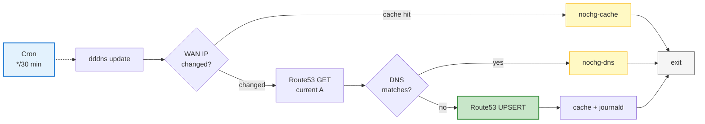
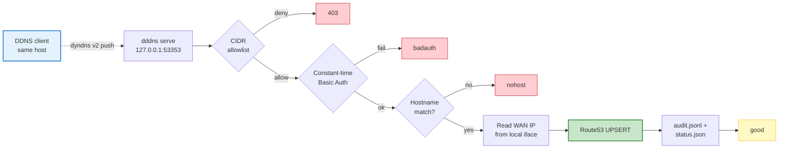
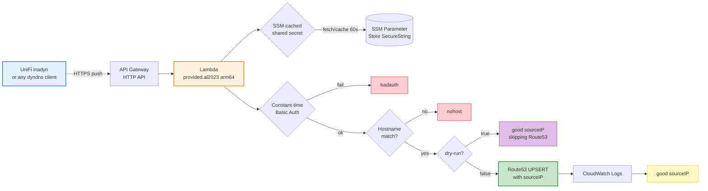

# Descoped Dynamic DNS - dddns

[](https://github.com/descoped/dddns/actions/workflows/ci.yml)
[](https://codecov.io/gh/descoped/dddns)
[](https://goreportcard.com/report/github.com/descoped/dddns)
[](https://github.com/descoped/dddns/releases)
[](https://github.com/descoped/dddns/blob/main/LICENSE)
[](https://go.dev/)
[](https://github.com/descoped/dddns/releases)

Most home networks receive dynamic public IP addresses via DHCP lease from ISPs, which can change on lease renewal or connection reset.
Dynamic DNS (DDNS) solves this by automatically updating DNS records when your IP changes, keeping your domain (like `home.example.com`) always pointing to your current IP.

**dddns** is a lightweight, secure DDNS client specifically for AWS Route53, designed to run on resource-constrained devices like Ubiquiti Dream Machines.
Perfect for VPN access, home servers, remote management, or any service that needs consistent access to your home network.

## Features

### 🚀 Core Functionality
- **AWS Route53 Integration** - Updates DNS A records automatically (Route53 only)
- **Smart IP Detection** - Reliable public IP detection via checkip.amazonaws.com
- **Change Detection** - Only updates when IP actually changes
- **Persistent Caching** - Remembers last IP to minimize API calls
- **Proxy/VPN Protection** - Detects and prevents updates when behind proxy
- **Dry Run Mode** - Test changes without modifying DNS records
- **Force Updates** - Override cache when needed

### 🔒 Security
- **Device-Specific Encryption** - AES-256-GCM with hardware-derived keys
- **Secure Credential Storage** - Encrypted configs locked to specific hardware
- **No Environment Variables** - Credentials stored securely in config files
- **File Permission Enforcement** - Automatic 600/400 permissions
- **Memory Wiping** - Sensitive data cleared after use
- **AWS Profile Support** - Integrates with AWS CLI credentials

### 🖥️ Platform Support
- **Ubiquiti Dream Machine** - UDM/UDR with UniFi OS v3/v4
- **Linux** - AMD64, ARM64, ARM architectures
- **macOS** - Intel and Apple Silicon
- **Windows** - AMD64 and ARM64
- **Docker** - Container deployment ready
- **Automatic Platform Detection** - Adjusts paths and behavior per platform

### 📦 Deployment

Three deployment forms, pick whichever matches your setup:

- **Cron mode** — on-device polling every 30 minutes. The proven default for UDM / UDR / Raspberry Pi. Output flows through `journalctl -t dddns`; rotation handled by journald.
- **Serve mode** — on-device event-driven listener for a same-host DDNS client (ddclient, a user script, a Docker sidecar). Supervised by systemd. **Experimental on UniFi Dream** — UniFi's built-in inadyn can't reach the loopback listener; use cron or Lambda there.
- **Lambda mode** (v0.3.0+) — AWS Lambda + API Gateway endpoint. Event-driven from the cloud, provisioned via OpenTofu. Ideal when UniFi UI's Custom Dynamic DNS is the push source. Costs ~$0/month at household scale. See [`deploy/aws-lambda/README.md`](deploy/aws-lambda/README.md).

Other deployment traits:
- **Single Binary** - No dependencies, <10MB size (6MB for the Lambda zip)
- **Low Memory** - <20MB runtime usage; `GOMEMLIMIT=16MiB` ceiling on serve + Lambda
- **Boot Persistence** - Survives firmware updates on UDM
- **Cross-platform builds** - GoReleaser produces Linux / macOS / Windows / UDM artefacts on every tag


## Quick Start

> **📋 Prerequisites**: Need to set up AWS Route53 first? See the [AWS Setup Guide](docs/aws-setup.md) for step-by-step instructions.

### Ubiquiti Dream Machine (UDM/UDR)

```bash
# One-line installation (prompts for cron or serve mode on fresh install)
bash <(curl -fsL https://raw.githubusercontent.com/descoped/dddns/main/scripts/install-on-unifi-os.sh)

# Configure
dddns config init

# Test
dddns update --dry-run

# Privacy-safe self-diagnosis (great to paste in a GitHub issue)
bash <(curl -fsL https://raw.githubusercontent.com/descoped/dddns/main/scripts/install-on-unifi-os.sh) --probe
```

> **⚠️ Compatibility Note**: Check [supported models and requirements](docs/installation.md#supported-models) before installation.

### AWS Lambda (v0.3.0+, any cloud-hosted push target)

If the DDNS push source is UniFi UI's Custom Dynamic DNS entry and
you don't want to run anything on-device, deploy dddns as an AWS
Lambda behind API Gateway. The OpenTofu module at
[`deploy/aws-lambda/tofu/`](deploy/aws-lambda/tofu/) provisions the
whole stack in one apply — Lambda, API Gateway, IAM, SSM parameter,
CloudWatch log group.

```bash
# Build the Lambda zip (Linux arm64, provided.al2023)
just build-aws-lambda

# Configure your deployment (zone ID + hostname)
cd deploy/aws-lambda/tofu
cp terraform.tfvars.example terraform.tfvars
$EDITOR terraform.tfvars

# Deploy
tofu init && tofu apply

# Rotate secret and paste into UniFi UI
cd .. && ./scripts/rotate-secret.sh
```

Household-scale deployments stay in the AWS free tier. See
[`deploy/aws-lambda/README.md`](deploy/aws-lambda/README.md) for
the full guide, cost breakdown, and teardown instructions.

### macOS

```bash
# Install via Homebrew
brew tap descoped/tap
brew install dddns

# Configure and run
dddns config init
dddns update
```

### Linux

#### Debian/Ubuntu
```bash
# Download and install the .deb package
curl -LO https://github.com/descoped/dddns/releases/latest/download/dddns_Linux_x86_64.deb
sudo dpkg -i dddns_Linux_x86_64.deb

# For ARM64 systems:
curl -LO https://github.com/descoped/dddns/releases/latest/download/dddns_Linux_arm64.deb
sudo dpkg -i dddns_Linux_arm64.deb
```

#### Red Hat/CentOS/Fedora
```bash
# Install the .rpm package
sudo rpm -ivh https://github.com/descoped/dddns/releases/latest/download/dddns_Linux_x86_64.rpm

# For ARM64 systems:
sudo rpm -ivh https://github.com/descoped/dddns/releases/latest/download/dddns_Linux_arm64.rpm
```

#### Configure and run
```bash
dddns config init
dddns update
```

## Commands

```bash
dddns update [--dry-run] [--force] [--quiet]  # Update DNS record
dddns config init                              # Interactive configuration
dddns config check                             # Validate configuration
dddns ip                                       # Show current public IP
dddns verify                                   # Check DNS vs current IP
dddns secure enable                            # Enable encrypted config
dddns --version                                # Show version
```

## Documentation

- [Quick Start](docs/quick-start.md) - Get running in 5 minutes
- [AWS Setup Guide](docs/aws-setup.md) - **Start here if new to Route53** - Complete AWS setup
- [Installation Guide](docs/installation.md) - Detailed installation instructions
- [Configuration](docs/configuration.md) - Configuration options
- [Commands](docs/commands.md) - Full command reference
- [UDM Guide](docs/udm-guide.md) - Ubiquiti-specific setup
- [Troubleshooting](docs/troubleshooting.md) - Common issues and solutions

## How It Works

dddns has three deployment forms. Pick one at install time; they are mutually exclusive.

| Form | Trigger | Where dddns runs | Fits when |
|---|---|---|---|
| **Cron** | Time-based (every N minutes) | On-device (UniFi, Pi, Linux, macOS) | Simple, self-contained. Default choice for most installs. |
| **Serve** | Event-based (dyndns v2 push) | On-device, listens on 127.0.0.1 | A same-host DDNS client pushes on IP change. **Experimental on UniFi Dream** — see note below. |
| **Lambda** | Event-based (HTTPS push) | AWS Lambda + API Gateway | Push source cannot reach a loopback listener (e.g. UniFi UI's built-in `inadyn` with `-b eth4`). Also the right choice when the router itself is unreliable. |

### Cron mode (polling)


```mermaid
flowchart LR
    A[Cron<br/>*/30 min]:::start -.-> B[dddns update]
    B --> C{WAN IP<br/>changed?}
    C -->|cache hit| G[nochg-cache]:::skip
    C -->|changed| F[Route53 GET<br/>current A]
    F --> H{DNS<br/>matches?}
    H -->|yes| J[nochg-dns]:::skip
    H -->|no| I[Route53 UPSERT]:::update
    I --> K[cache + journald]
    G --> L[exit]:::exit
    J --> L
    K --> L

    classDef start fill:#e3f2fd,stroke:#1976d2,stroke-width:2px
    classDef update fill:#c8e6c9,stroke:#388e3c,stroke-width:2px
    classDef skip fill:#fff9c4,stroke:#fbc02d
    classDef exit fill:#f5f5f5,stroke:#616161
```

Two short-circuits — cache match and DNS match — keep API calls near-zero when the IP is stable.

### Serve mode (event-driven, on-device)


```mermaid
flowchart LR
    A[DDNS client<br/>same host]:::start -.->|dyndns v2 push| B[dddns serve<br/>127.0.0.1:53353]
    B --> C{CIDR<br/>allowlist}
    C -->|deny| X[403]:::deny
    C -->|allow| D{Constant-time<br/>Basic Auth}
    D -->|fail| Y[badauth]:::deny
    D -->|ok| E{Hostname<br/>match?}
    E -->|no| Z[nohost]:::deny
    E -->|yes| F[Read WAN IP<br/>from local iface]
    F --> G[Route53 UPSERT]:::update
    G --> H[audit.jsonl +<br/>status.json]
    H --> I[good]:::exit

    classDef start fill:#e3f2fd,stroke:#1976d2,stroke-width:2px
    classDef update fill:#c8e6c9,stroke:#388e3c,stroke-width:2px
    classDef deny fill:#ffcdd2,stroke:#c62828
    classDef exit fill:#fff9c4,stroke:#fbc02d
```

The handler **never trusts the `myip` query parameter** — it publishes the WAN interface's actual IP (ground truth). Systemd supervises the process with `Restart=always`.

> ⚠️ **Experimental on UniFi Dream (UDM / UDR)**: UniFi's built-in `inadyn` binds with `-b eth4`, which forces every connection — including to `127.0.0.1` — through the WAN policy routing table (`table 201.eth4`). That table has no route for loopback, so the push never reaches the listener. Serve mode works on Raspberry Pi, generic Linux, macOS, and Docker with a same-host DDNS client, but **not** with UniFi's built-in pusher. On UniFi Dream devices, use **Lambda mode** instead.

### Lambda mode (event-driven, cloud)


```mermaid
flowchart LR
    A[UniFi inadyn<br/>or any dyndns client]:::start -.->|HTTPS push| B[API Gateway<br/>HTTP API]
    B --> C[Lambda<br/>provided.al2023 arm64]:::lambda
    C --> D{SSM-cached<br/>shared secret}
    D -->|fetch/cache 60s| E[(SSM Parameter<br/>Store SecureString)]
    C --> F{Constant-time<br/>Basic Auth}
    F -->|fail| Y[badauth]:::deny
    F -->|ok| G{Hostname<br/>match?}
    G -->|no| Z[nohost]:::deny
    G -->|yes| H{dry-run?}
    H -->|true| DR[good sourceIP<br/>skipping Route53]:::skip
    H -->|false| I[Route53 UPSERT<br/>with sourceIP]:::update
    I --> J[CloudWatch Logs]
    J --> K[good sourceIP]:::exit

    classDef start fill:#e3f2fd,stroke:#1976d2,stroke-width:2px
    classDef lambda fill:#fff3e0,stroke:#f57c00,stroke-width:2px
    classDef update fill:#c8e6c9,stroke:#388e3c,stroke-width:2px
    classDef skip fill:#e1bee7,stroke:#8e24aa
    classDef deny fill:#ffcdd2,stroke:#c62828
    classDef exit fill:#fff9c4,stroke:#fbc02d
```

The IP published to Route53 is **always** `requestContext.http.sourceIp` (the TCP peer recorded by API Gateway). The `myip=` query parameter is ignored — same "never trust client-supplied values" posture as serve mode.

Deployed via an OpenTofu module at `deploy/aws-lambda/tofu/` (13 AWS resources, all configurable). The IAM policy is scoped to exactly one zone + one record + UPSERT-only + A-only + one SSM parameter + KMS `aws/ssm` with a `kms:ViaService` condition. See [`deploy/aws-lambda/README.md`](deploy/aws-lambda/README.md).

> **💡 Cost Tip**: Route53 hosts a zone for ~USD 0.50/month plus query fees. Lambda + API Gateway + SSM + CloudWatch at household-scale push volume stay firmly in AWS's free tier — a realistic personal deployment is $0/month for the first year and single-digit cents afterwards.

## Development

### Prerequisites

- Go 1.26+
- [just](https://github.com/casey/just) (`brew install just` on macOS)
- [OpenTofu](https://opentofu.org/) 1.6+ (only needed to deploy the AWS Lambda form)

### Building

```bash
# Clone repository
git clone https://github.com/descoped/dddns.git
cd dddns

# Build for current platform
just build

# Race build for local dev
just dev

# Run tests
just test

# Cross-platform release binaries are produced by GoReleaser on every
# tag push — see .github/workflows/goreleaser.yml. To exercise it
# locally, install goreleaser and run `goreleaser build --snapshot`.
```

### Project Structure

```
cmd/                  # CLI commands
internal/
├── config/          # Configuration management
├── crypto/          # Device-specific encryption
├── dns/             # Route53 client
├── profile/         # Platform detection
└── version/         # Version information
```

### Release Process

Releases use [GoReleaser](https://goreleaser.com/) with git tags:

```bash
git tag v1.0.0
git push origin v1.0.0
```

GitHub Actions automatically builds and releases binaries for all platforms.

## Configuration

> **Need AWS Route53?** Follow the [AWS Setup Guide](docs/aws-setup.md) to create your hosted zone and IAM credentials first.

### Example Configuration

```yaml
# ~/.dddns/config.yaml
aws_region: us-east-1
hosted_zone_id: ZXXXXXXXXXXXXX  # Get this from AWS Setup Guide
hostname: home.example.com
ttl: 300

# AWS credentials (or use AWS profile)
access_key: AKIAXXXXXXXXXXXXXX
secret_key: xxxxxxxxxxxxxxxxxxxxxxxxxxxxxxxxxxxxxxxx
```

### Secure Configuration

For enhanced security, use encrypted configuration:

```bash
# Convert to encrypted config
dddns secure enable

# Config is now encrypted with device-specific key
# Cannot be moved between devices
```

## Support

### Reporting Issues

If you encounter any problems:

1. Check the [Troubleshooting Guide](docs/troubleshooting.md) first
2. Search [existing issues](https://github.com/descoped/dddns/issues) to see if it's already reported
3. Create a [new issue](https://github.com/descoped/dddns/issues/new) with:
   - Your platform (UDM model, OS version)
   - dddns version (`dddns --version`)
   - Error messages or logs
   - Steps to reproduce

### Getting Help

- 📖 [Documentation](docs/) - Comprehensive guides
- 🐛 [Issues](https://github.com/descoped/dddns/issues) - Report bugs or request features
- 💬 [Discussions](https://github.com/descoped/dddns/discussions) - Ask questions and share ideas

## Contributing

We welcome contributions! Whether it's bug fixes, new features, or documentation improvements, your help is appreciated.

### How to Contribute

1. Fork the repository
2. Create a feature branch (`git checkout -b feature/amazing-feature`)
3. Make your changes
4. Run tests (`just test`)
5. Commit your changes (`git commit -m 'feat: add amazing feature'`)
6. Push to your branch (`git push origin feature/amazing-feature`)
7. Open a Pull Request

### Development Guidelines

- Follow Go best practices and conventions
- Add tests for new functionality
- Update documentation as needed
- Keep commits atomic and well-described
- Ensure all tests pass before submitting PR

### Areas for Contribution

- 🐛 Bug fixes
- 📚 Documentation improvements
- 🧪 Test coverage expansion
- 🔧 Performance optimizations
- 🎨 Code refactoring
- 🌐 Support for more DNS providers

## License

This project is licensed under the MIT License - see the [LICENSE](LICENSE) file for details.

---

**Note**: This tool is specifically designed for AWS Route53. If you need support for other DNS providers, please open an issue to discuss potential implementation.
